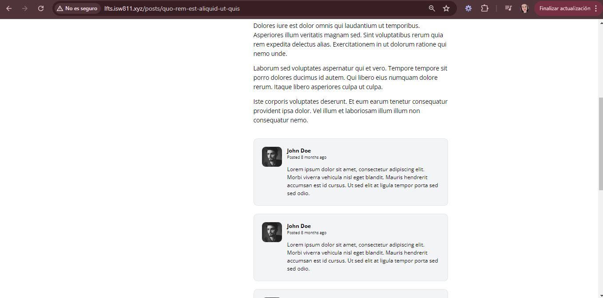

[< Volver al índice](../index.md)

# Write the Markup for a Post Comment

Para este episodio se crea una seccion de comentarios cuando se ingresa a observar el detalle del post, por el momento se manejan datos quemados. Para ello se realiza lo siguiente:

- ### Crear un archivo llamado post-comments.blade.php en la ruta _resources/views/components_

El mismo contiene el siguiente codigo

```php
<article class="flex bg-gray-100 border border-gray-200 p-6 rounded-xl space-x-4">
    <div class="flex-shrink-0">
        
    </div>

    <div>
        <header class="mb-4">
            <h3 class="font-bold">John Doe</h3>

            <p class="text-xs">
                Posted
                <time>8 months ago</time>
            </p>
        </header>

        <p>
            Lorem ipsum dolor sit amet, consectetur adipiscing elit. Morbi viverra vehicula nisl
            eget blandit. Mauris hendrerit accumsan est id cursus. Ut sed elit at ligula tempor
            porta sed sed odio.
        </p>
    </div>
</article>
```

- ### Posteriomente se agrega un componente blade en el archivo *show.blade.php* 

Se agrega el componente blade que acabamos de crear en el codigo de show.blade.php, quedando de la siguiente manera:

```php
<section class="col-span-8 col-start-5 mt-10 space-y-6">
    <x-post-comment />
    <x-post-comment />
    <x-post-comment />
    <x-post-comment />
</section>
```

Este se agrega cuando se cierra el div del post pero dentro del mismo `article`.

Esto luce asi:


