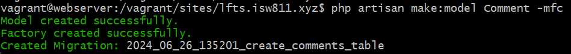
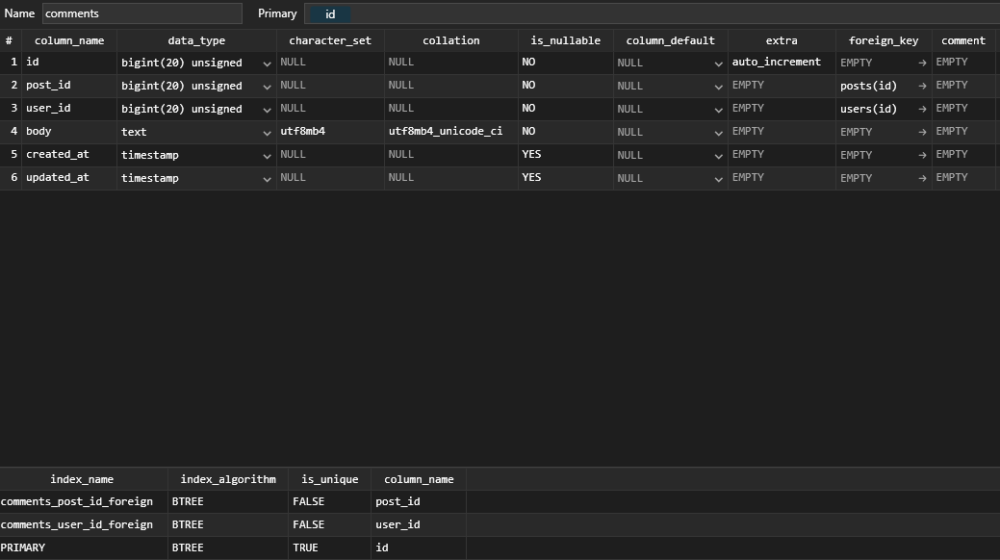

[< Volver al índice](../index.md)

# Table Consistency and Foreign Key Constraints

- Primeramente se debe ubicar en la carpeta raiz del proyecto `cd /vagrant/sites/lfts.isw811.xyz/`
- Se ejecuta el siguiente comando bash para crear el modelo Comment junto con su factory y controller `php artisan make:model Comment -mfc` lo que da el siguiente resultado:



Esto nos crea los archivos _CommentController.php_, el modelo _Comment.php_, el factory _CommentFactory.php_ y la migracion de la tabla Comments, en mi caso es _2024_06_26_135201_create_comments_table.php_.

- A la funcion *up* de la migracion de los comments, se le agregan los atributos que vamos a necesitar segun el siguiente codigo:

```php
public function up()
    {
        Schema::create('comments', function (Blueprint $table) {
            $table->id();
            $table->foreignId('post_id')->constrained()->cascadeOnDelete();
            $table->foreignId('user_id')->constrained()->cascadeOnDelete();
            $table->text('body');
            $table->timestamps();
        });
    }
```
- Ejecutamos `php artisan migrate` para que nos cree la tabla de _comments_ la cual deberia de lucir asi en nuestra Base de datos con sus respectivas Foreign Keys:



- Realizamos lo mismo con el archivo de migracion de los posts y al atributo del _user_id_ le realizamos lo mismo:

```php
$table->foreignId('user_id')->constrained()->cascadeOnDelete();
```


