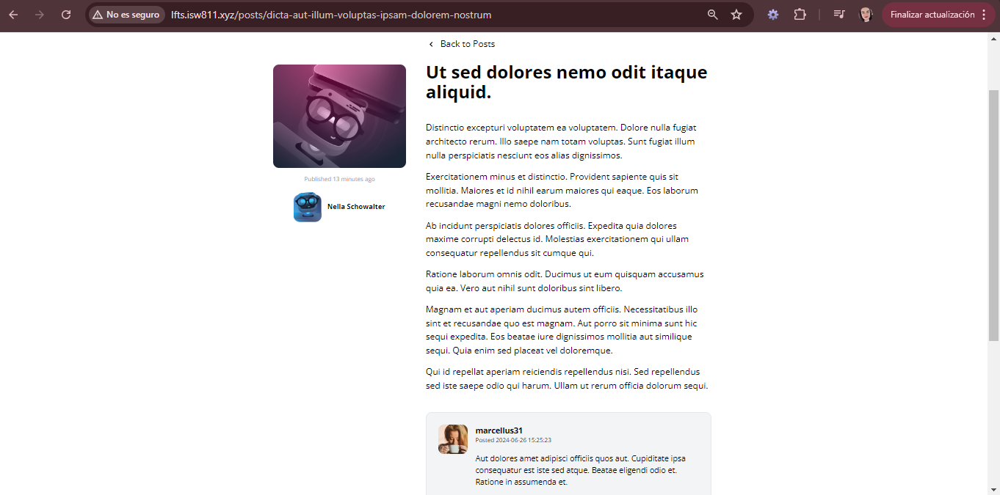

[< Volver al índice](../index.md)

# Make the Comments Section Dynamic

En este capitulo se renderiza el contenido de los comentarios de los posts para que funcionen de forma dinamica, por lo que se deben de realizar las siguientes modificaciones en el codigo de los siguientes archivos:

- #### CommentFactory.php

Para crear contenido en cada migracion:

```php
class CommentFactory extends Factory
{

    protected $model = Comment::class;
    /**
     * Define the model's default state.
     *
     * @return array
     */
    public function definition()
    {
        return [
            'post_id' => Post::factory(),
            'user_id' => User::factory(),
            'body' => $this->faker->paragraph()
        ];
    }
}
```

Esto lo probamos ejecutando el comando `php artisan tinker` y luego `App\Models\Comment::factory()->create();` y esto nos deberia crear con exito el registro:


- #### Post.php

Aca realizamos la relacion entre el post y los comentarios asociados a el en nuestra base de datos agregando la funcion `comments()`

```php
public function comments()
    {
        return $this->hasMany(Comment::class);
    }
```

- #### Comment.php

Agregamos la asociacion con el autor:

```php
public function author()
    {
        return $this->belongsTo(User::class, 'user_id');
    }
```

- #### show.blade.php

Agregamos la iteracion del componente blade para que nos brinde todos los comentarios:

```php
<section class="col-span-8 col-start-5 mt-10 space-y-6">
    @foreach ($post->comments as $comment)
        <x-post-comment :comment="$comment" />
    @endforeach
</section>
```

- #### post-comment.blade.php

Agregamos el contenido del comentario en vez de un html "quemado":

```php
<article class="flex bg-gray-100 border border-gray-200 p-6 rounded-xl space-x-4">
    <div class="flex-shrink-0">
        id }}" alt="" width="60" height="60" class="rounded-xl">
    </div>

    <div>
        <header class="mb-4">
            <h3 class="font-bold">{{ $comment->author->username }}</h3>

            <p class="text-xs">
                Posted
                <time>{{ $comment->created_at }}</time>
            </p>
        </header>

        <p>
            {{ $comment->body }}
        </p>
    </div>
</article>
```

Y esto luce asi en nuestra aplicacion:


