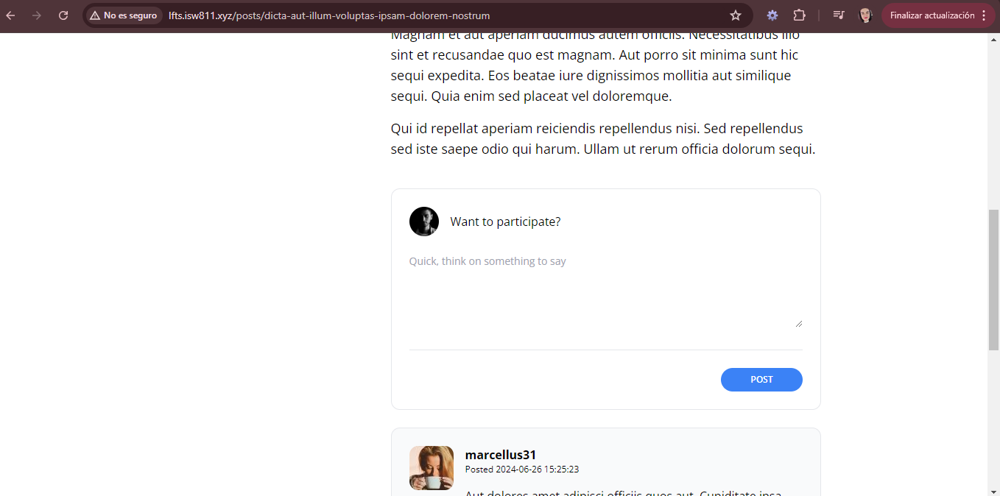

[< Volver al índice](../index.md)

# Design the Comment Form

En este episodio se realizan unos ajustes de diseño para que se observe un form para crear un comentario, para ello se realizan las siguientes modificaciones:

- #### planel.blade.php

Se crea un archivo llamado **panel.blade.php** dentro de la ruta *resources/views/components* y se agrega el siguiente codigo:

```php
<div {{ $attributes(['class'=> 'border border-gray-200 p-6 rounded-xl'])}}>
    {{$slot}}
</div>

```
- #### show.blade.php

Se agrega el siguiente `form` envuelto dentro del componente `panel`:

```html
<x-panel>
    <form method="POST" action="#">
        @csrf

        <header class = "flex items-center">
            id() }}" alt="" width="40" height="60" class="rounded-full">
            <h2 class="ml-4">Want to participate?</h2>
        </header>

        <div class="mt-6">
            <textarea name="body" class="w-full text-sm focus:outline-none focus:ring" cols="30" rows="5" placeholder="Quick, think on something to say"></textarea>
        </div>

        <div class="flex justify-end mt-6 pt-6 border-t border-gray-200">
            <button type="submit" class="bg-blue-500 text-white uppercase font-semibold text-xs py-2 px-10 rounded-2xl hover:bg-blue-600">POST</button>
        </div>
    </form>
</x-panel>
```

- #### post-comment.blade.php

Se hace lo mismo que el codigo anterior, quedando de la siguiente manera:

```php

<x-panel class="bg-gray-50">
    <article class="flex space-x-4">
        <div class="flex-shrink-0">
            id }}" alt="" width="60" height="60" class="rounded-xl">
        </div>

        <div>
            <header class="mb-4">
                <h3 class="font-bold">{{ $comment->author->username }}</h3>

                <p class="text-xs">
                    Posted
                    <time>{{ $comment->created_at }}</time>
                </p>
            </header>

            <p>
                {{ $comment->body }}
            </p>
        </div>
    </article>
</x-panel>
```

Esto luce asi en nuestra aplicacion web:




