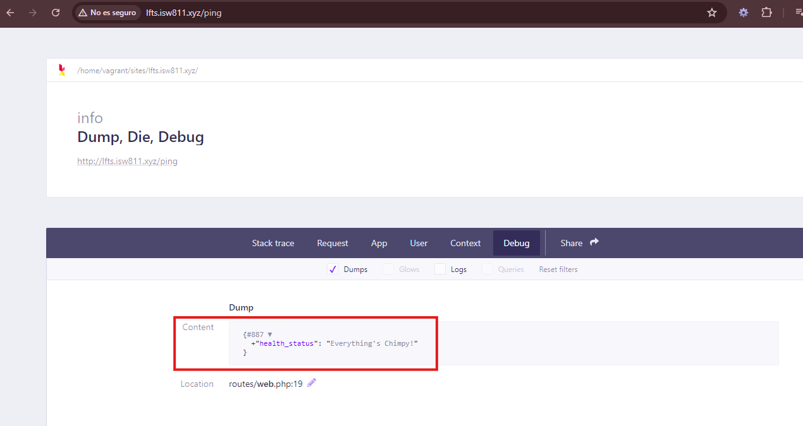

[< Volver al índice](../index.md)

# Mailchimp API Tinkering

Mailchimp nos permite crear listas de audencias, correos electronicos para enviar publicaciones digitales para el manejo de marketing y publicidad de la aplicacion web para suscripciones, entre otros. 

- Primeramente para crear una cuenta se debe ingresar a la pagina web de [Mailchimp](https://mailchimp.com/es/) y se seelecciona el plan gratuito, se activa la cuenta seleccionando el enlace que llega al correo y se llenan los datos que la misma pagina web necesita.

- Ya estando autenticado dentro de la cuenta de Mailchimp, nos vamos a la opcion que dice *Cuenta* seleccionamos *Extras* y luego en *API Keys* y creamos una.

- Posteriormente la copiamos en nuestro archivo de configuracion *.env* de la siguiente manera:

```
MAILCHIMP_KEY="KEY"
```

- Luego agregamos el servicio en el archivo *services.php* ubicado en la ruta *config/services.php*

```php
'mailchimp' => [
    'key' => env('MAILCHIMP_KEY'),
    'lists' => [
        'subscribers' => env('MAILCHIMP_LIST_SUBSCRIBERS')
    ]
]
```

Para verificar que este correcto limpiamos la cache del archivo config con los comandos `php artisan config:cache` y 
`php artisan config:clear` y luego ingresar=mos a Tinker con `php artisan tinker` y ejecutamos el comando `config('services.mailchimp')` y esto nos debe arrojar la key que ingresamos en nuestra variable de entorno.

- Luego ejecutamos el comando `composer require mailchimp/marketing` para instalar las liberias necesarias para utilizar Mailchimp.

- Posteriormente agregamos el siguiente codigo en nuestro archivo *web.php*

```php
Route::get('ping', function(){

    $mailchimp = new \MailchimpMarketing\ApiClient();

    $mailchimp->setConfig([
        'apiKey' => config('services.mailchimp.key'),
        'server' => 'us13'
    ]);

    $response = $mailchimp->ping->get();
    ddd($response);
});
```
Esto para probar que todo funcione correctamente. El *apiKey* es el que tenemos en nuestra variable de entorno y el server es la denominacion que sale en nuestro url. Esto nos tiene que dar el siguiente resultado:




- Luego configuramos nuestro archivo *layout.php* y le agregamos el siguiente codigo:

    - Para agregar estilo al seleccionar el boton *SUSCRIBE FOR UPDATES*:

```php
<style>
    html {
        scroll-behavior: smooth;
    }
    .clamp {
        display: -webkit-box;
        -webkit-box-orient: vertical;
        overflow: hidden;
    }
    .clamp.one-line {
        -webkit-line-clamp: 1;
    }
</style>
```

 - Y luego se le agrega un id al footer para acceder a esta seccion del home en caso de seleccionar el boton:

 ```php
<footer id="newsletter" class="bg-gray-100 border border-black border-opacity-5 rounded-xl text-center py-16 px-10 mt-16">
 ```
