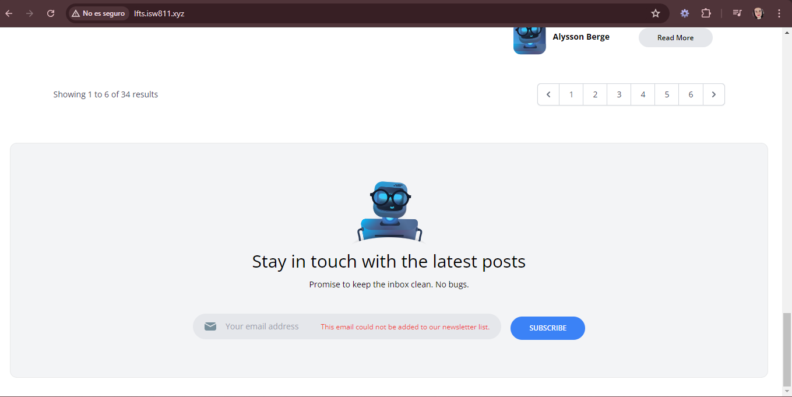
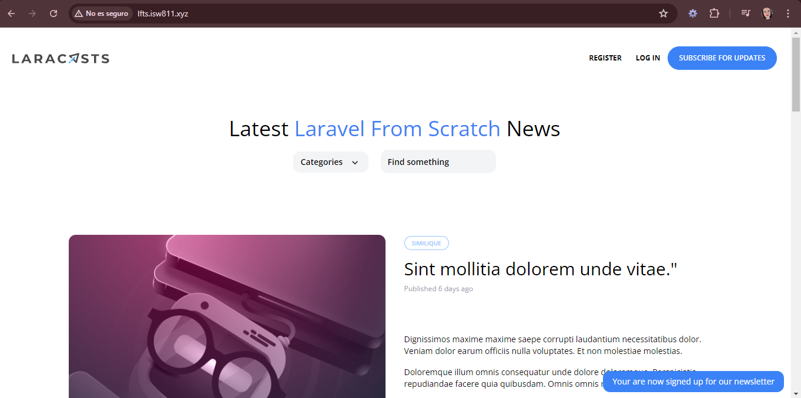

[< Volver al índice](../index.md)

# Make the Newsletter Form Work

En este episodio se realiza la funcion para agregar contactos a la lista de suscripciones, para lo cual se realiza lo siguiente:

- Eliminamos la ruta de *ping* y agregamos el siguiente codigo en el archivo **web.php:

```php
Route::post('newsletter', function() {

    request()->validate(['email'=>'required|email']);

    $mailchimp = new \MailchimpMarketing\ApiClient();

    $mailchimp->setConfig([
        'apiKey' => config('services.mailchimp.key'),
        'server' => 'us13'
    ]);

    try{
        $response = $mailchimp->lists->addListMember('6d4b7954ba', [
            'email_address' => request('email'),
            'status' => 'subscribed'
        ]);
    }catch(\Exception $e){

        throw \Illuminate\Validation\ValidationException::withMessages([
            'email'=>'This email could not be added to our newsletter list.'
        ]);
    }
    return redirect('/')
        ->with('success', 'Your are now signed up for our newsletter');
});
```

- Y modificamos el archivo *layourt.php* para que nos muestre mensaje de error en caso de que el correo no sea valido y que rediriga a */newsletter*, quedando de la siguiente manera:

```php
<div>
    <input id="email"
        name="email"
        type="text"
        placeholder="Your email address"
        class="lg:bg-transparent py-2 lg:py-0 pl-4 focus-within:outline-none">

    @error('email')
        <span class="text-xs text-red-500">{{ $message }}</span>
    @enderror
</div>
```

Esto nos permite que nuestra suscripcion funcione correctamente:

#### Email con error




#### Email exitoso


