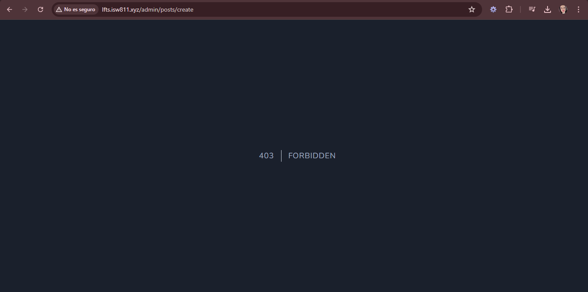
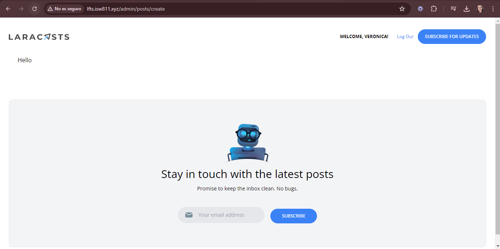

[< Volver al índice](../index.md)

# Limit Access to Only Admins

Para este episodio se realizan los ajustes necesarios para solamente usuarios autenticados y administradores puedan crear posts, para ello se realiza lo siguiente:

1. En nuestro archivo *PostController.php* agregamos dos nuevas funciones:

```php
public function create()
{
    return view('posts.create');
}

public function store()
{
    $attributes = request()->validate([
        'title' => 'required',
        'slug' => ['required', Rule::unique('posts', 'slug')],
        'excerpt' => 'required',
        'body' => 'required',
        'category_id' => ['required', Rule::exists('categories', 'id')]
    ]);

    $attributes['user_id'] = auth()->id();

    Post::create($attributes);

    return redirect('/');
}
```

2. Creamos nuestra vista *create.blade.php* en la ruta *resources/posts* y agregamos el siguiente codigo:

```php
<x-layout>
    <section class="px-6 py-8">
        Hello
    </section>
</x-layout>

```

3. Luego agregamos dos nuevas rutas en *web.php*

```php
Route::get('admin/posts/create', [PostController::class, 'create'])->middleware('admin');
Route::post('admin/posts', [PostController::class, 'store'])->middleware('admin');
```

Esto con el middleware que se crea a continuacion.

4. Ejecutamos el comando `php artisan make:middleware MustBeAdministrator` y al archivo creado en la carpeta *Middleware* agregamos el siguiente codigo:

```php
public function handle(Request $request, Closure $next)
    {
        if (auth()->user()?->username !== 'Verogc9612') {
            abort(Response::HTTP_FORBIDDEN);
        }

        return $next($request);
    }
```

5. Finalmente activamos el middleware en el archivo de clase Kernel y en `$routeMiddleware` agregamos la siguiente linea:

```php
'admin' => MustBeAdministrator::class,
```

Asi se debe observar en caso de que:

#### Usuario sin hacer log in o no administrador->



#### Usuario Administrador->


