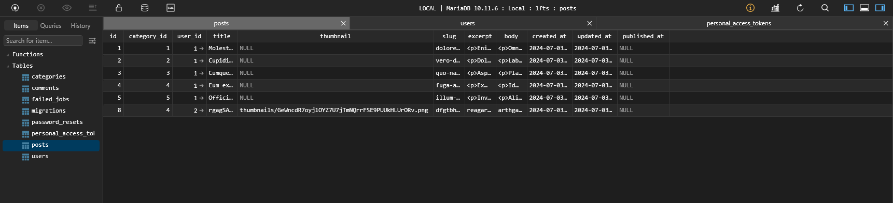
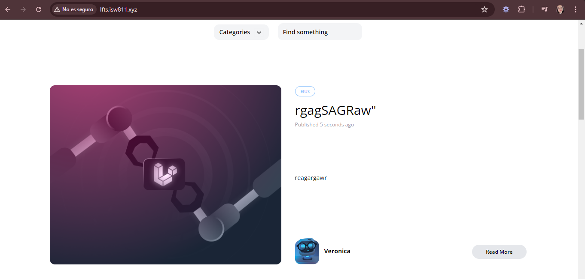

[< Volver al índice](../index.md)

# Validate and Store Post Thumbnails

En este episodio se modifica el form de Crear Post y se incluye la opcion de agregar imagenes al mismo utilizando thumbnail, para ello se realizan las siguientes modificaciones:

#### En el archivo *create.blade.php*

Se realiza modificacion en el titulo y se le agrega estilo, ademas se agrega un espacio mas en el form para cargar imagenes, y en el form se le agrega un *enctype*.

```php
<x-layout>
    <section class="py-8 max-w-md mx-auto">
        <h1 class="text-lg font-bold mb-4">
            Publish New Post
        </h1>

        <x-panel>
            <form method="POST" action="/admin/posts" enctype="multipart/form-data">
                @csrf

                <div class="mb-6">
                    <label class="block mb-2 uppercase font-bold text-xs text-gray-700"
                           for="title"
                    >
                        Title
                    </label>

                    <input class="border border-gray-400 p-2 w-full"
                           type="text"
                           name="title"
                           id="title"
                           value="{{ old('title') }}"
                           required
                    >

                    @error('title')
                        <p class="text-red-500 text-xs mt-2">{{ $message }}</p>
                    @enderror
                </div>

                <div class="mb-6">
                    <label class="block mb-2 uppercase font-bold text-xs text-gray-700"
                           for="slug"
                    >
                        Slug
                    </label>

                    <input class="border border-gray-400 p-2 w-full"
                           type="text"
                           name="slug"
                           id="slug"
                           value="{{ old('slug') }}"
                           required
                    >

                    @error('slug')
                        <p class="text-red-500 text-xs mt-2">{{ $message }}</p>
                    @enderror
                </div>

                <div class="mb-6">
                    <label class="block mb-2 uppercase font-bold text-xs text-gray-700"
                           for="thumbnail"
                    >
                        Thumbnail
                    </label>

                    <input class="border border-gray-400 p-2 w-full"
                           type="file"
                           name="thumbnail"
                           id="thumbnail"
                           required
                    >

                    @error('thumbnail')
                        <p class="text-red-500 text-xs mt-2">{{ $message }}</p>
                    @enderror
                </div>

                <div class="mb-6">
                    <label class="block mb-2 uppercase font-bold text-xs text-gray-700"
                           for="excerpt"
                    >
                        Excerpt
                    </label>

                    <textarea class="border border-gray-400 p-2 w-full"
                           name="excerpt"
                           id="excerpt"
                           required
                    >{{ old('excerpt') }}</textarea>

                    @error('excerpt')
                        <p class="text-red-500 text-xs mt-2">{{ $message }}</p>
                    @enderror
                </div>

                <div class="mb-6">
                    <label class="block mb-2 uppercase font-bold text-xs text-gray-700"
                           for="body"
                    >
                        Body
                    </label>

                    <textarea class="border border-gray-400 p-2 w-full"
                           name="body"
                           id="body"
                           required
                    >{{ old('body') }}</textarea>

                    @error('body')
                        <p class="text-red-500 text-xs mt-2">{{ $message }}</p>
                    @enderror
                </div>

                <div class="mb-6">
                    <label class="block mb-2 uppercase font-bold text-xs text-gray-700"
                           for="category_id"
                    >
                        Category
                    </label>

                    <select name="category_id" id="category_id">
                        @foreach (\App\Models\Category::all() as $category)
                            <option
                                value="{{ $category->id }}"
                                {{ old('category_id') == $category->id ? 'selected' : '' }}
                            >{{ ucwords($category->name) }}</option>
                        @endforeach
                    </select>

                    @error('category')
                        <p class="text-red-500 text-xs mt-2">{{ $message }}</p>
                    @enderror
                </div>

                <x-submit-button>Publish</x-submit-button>
            </form>
        </x-panel>
    </section>
</x-layout>
```

#### En el archivo *filesystems.php* ubicado en la carpeta *config* le cambiamos la carpeta del disco "local" por "public"

```php
 'default' => env('FILESYSTEM_DRIVER', 'public'),
```

Y lo actualizamos tambien en el `.env` de local a public -> `FILESYSTEM_DRIVER=public`

Y ejecutamos el comando `php artisan storage:link` para hacer el acceso en la carpeta public del proyecto de la ruta **storage/app/public**

#### En *PostController.php* en la funcion `store()` agregamos el atributo thumbnail

```php
public function store()
    {
        $attributes = request()->validate([
            'title' => 'required',
            'thumbnail' => 'required|image',
            'slug' => ['required', Rule::unique('posts', 'slug')],
            'excerpt' => 'required',
            'body' => 'required',
            'category_id' => ['required', Rule::exists('categories', 'id')]
        ]);

        $attributes['user_id'] = auth()->id();
        $attributes['thumbnail'] = request()->file('thumbnail')->store('thumbnails');

        Post::create($attributes);

        return redirect('/');
    }
```

#### En el archivo de migracion de *create_posts_table* agregamos un atributo mas para thumbnails en la funcion `up()`

```php
$table->string('thumbnail')->nullable();
```

Y ejecutamos el comando `php artisan migrate fresh --seed` para hacerle un  resfresh a la base de datos y rellenarla nuevamente.

#### Finalmente en los archivos *post-featured-card.blade.php*, *post-card.blade.php*, y *show.blade.php* cambiamos la linea donde estaba incluida la imagen del post "quemada" y lo cambiamos por la siguiente linea:

```php
thumbnail) }}" alt="Blog Post illustration" class="rounded-xl">
```

Esto para que acceda a la carpeta storage y la ruta de thumbnails/image.png que se encuentra en nuestra base de datos





