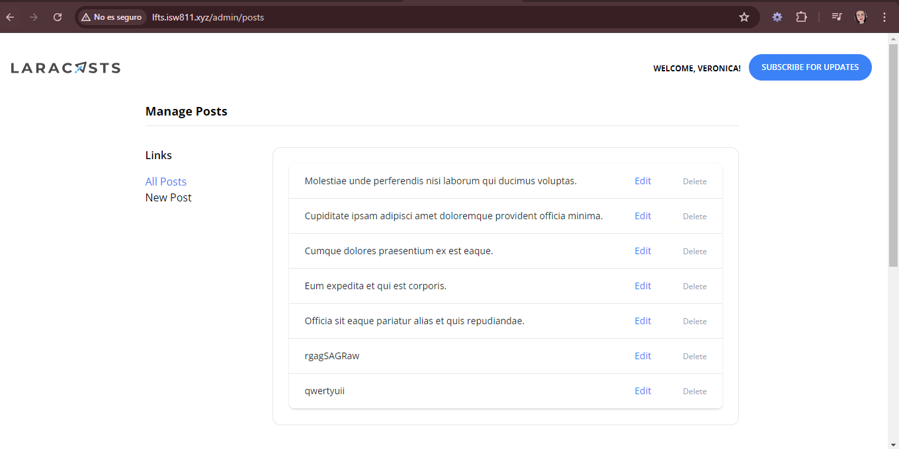
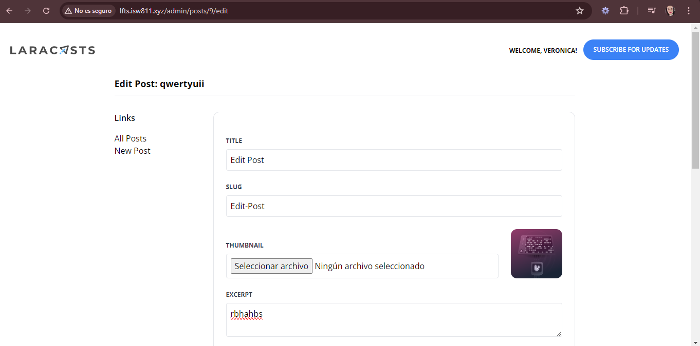
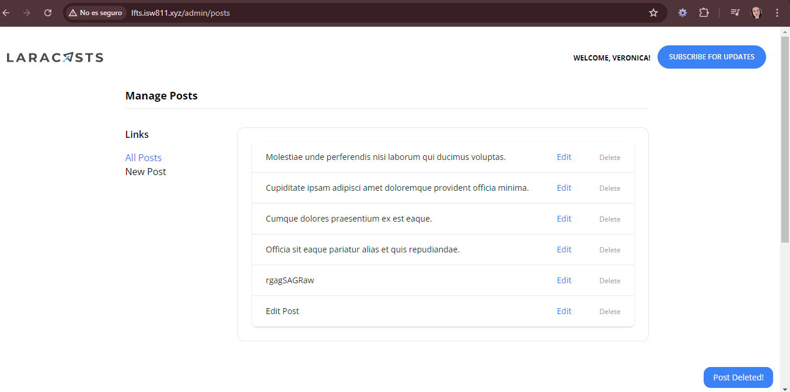

[< Volver al índice](../index.md)

# Create a Form to Edit and Delete Posts

- Primeramente agregamos las siguientes rutas dentro de *web.php* y eliminamos y eliminamos las que habian anteriormente de admin.

```php
Route::post('admin/posts', [AdminPostController::class, 'store'])->middleware('admin');
Route::get('admin/posts/create', [AdminPostController::class, 'create'])->middleware('admin');
Route::get('admin/posts', [AdminPostController::class, 'index'])->middleware('admin');
Route::get('admin/posts/{post}/edit', [AdminPostController::class, 'edit'])->middleware('admin');
Route::patch('admin/posts/{post}', [AdminPostController::class, 'update'])->middleware('admin');
Route::delete('admin/posts/{post}', [AdminPostController::class, 'destroy'])->middleware('admin');
```

- Luego creamos el controller *AdminPostController* con el comando `php artisan make:controller AdminPostController` y le agregamos las funciones `index()`, `create()`, `store()`, `edit()`, `update()` y `destroy()`:

```php
public function index()
{
    return view('admin.posts.index', [
        'posts' => Post::paginate(50)
    ]);
}

public function create()
{
    return view('admin.posts.create');
}

public function store()
{
    $attributes = request()->validate([
        'title' => 'required',
        'thumbnail' => 'required|image',
        'slug' => ['required', Rule::unique('posts', 'slug')],
        'excerpt' => 'required',
        'body' => 'required',
        'category_id' => ['required', Rule::exists('categories', 'id')]
    ]);

    $attributes['user_id'] = auth()->id();
    $attributes['thumbnail'] = request()->file('thumbnail')->store('thumbnails');

    Post::create($attributes);

    return redirect('/');
}

public function edit(Post $post)
{
    return view('admin.posts.edit', ['post' => $post]);
}

public function update(Post $post)
{
    $attributes = request()->validate([
        'title' => 'required',
        'thumbnail' => 'image',
        'slug' => ['required', Rule::unique('posts', 'slug')->ignore($post->id)],
        'excerpt' => 'required',
        'body' => 'required',
        'category_id' => ['required', Rule::exists('categories', 'id')]
    ]);

    if (isset($attributes['thumbnail'])) {
        $attributes['thumbnail'] = request()->file('thumbnail')->store('thumbnails');
    }

    $post->update($attributes);

    return back()->with('success', 'Post Updated!');
}

public function destroy(Post $post)
{
    $post->delete();

    return back()->with('success', 'Post Deleted!');
    }
```

Ademas eliminamos las funciones `create()` y `store()` de *PostController.php*.

- Seguidamente creamos un nuevo folder dentro de *resources/views* llamado *admin/posts* y ahi creamos los archivos *index.blade.php*, *create.blade.php* y *edit.blade.php* con el siguiente codigo:

#### index.blade.php

```php
<x-layout>
    <x-setting heading="Manage Posts">
        <div class="flex flex-col">
            <div class="-my-2 overflow-x-auto sm:-mx-6 lg:-mx-8">
                <div class="py-2 align-middle inline-block min-w-full sm:px-6 lg:px-8">
                    <div class="shadow overflow-hidden border-b border-gray-200 sm:rounded-lg">
                        <table class="min-w-full divide-y divide-gray-200">
                            <tbody class="bg-white divide-y divide-gray-200">
                                @foreach ($posts as $post)
                                    <tr>
                                        <td class="px-6 py-4 whitespace-nowrap">
                                            <div class="flex items-center">
                                                <div class="text-sm font-medium text-gray-900">
                                                    <a href="/posts/{{ $post->slug }}">
                                                        {{ $post->title }}
                                                    </a>
                                                </div>
                                            </div>
                                        </td>

                                        <td class="px-6 py-4 whitespace-nowrap text-right text-sm font-medium">
                                            <a href="/admin/posts/{{ $post->id }}/edit" class="text-blue-500 hover:text-blue-600">Edit</a>
                                        </td>

                                        <td class="px-6 py-4 whitespace-nowrap text-right text-sm font-medium">
                                            <form method="POST" action="/admin/posts/{{ $post->id }}">
                                                @csrf
                                                @method('DELETE')

                                                <button class="text-xs text-gray-400">Delete</button>
                                            </form>
                                        </td>
                                    </tr>
                                @endforeach
                            </tbody>
                        </table>
                    </div>
                </div>
            </div>
        </div>
    </x-setting>
</x-layout>
```

#### create.blade.php

```php
<x-layout>
    <x-setting heading="Publish New Post">
        <form method="POST" action="/admin/posts" enctype="multipart/form-data">
            @csrf

            <x-form.input name="title" required />
            <x-form.input name="slug" required />
            <x-form.input name="thumbnail" type="file" required />
            <x-form.textarea name="excerpt" required />
            <x-form.textarea name="body" required />

            <x-form.field>
                <x-form.label name="category"/>

                <select name="category_id" id="category_id" required>
                    @foreach (\App\Models\Category::all() as $category)
                        <option
                            value="{{ $category->id }}"
                            {{ old('category_id') == $category->id ? 'selected' : '' }}
                        >{{ ucwords($category->name) }}</option>
                    @endforeach
                </select>
                <x-form.error name="category"/>
            </x-form.field>
            <x-form.button>Publish</x-form.button>
        </form>
    </x-setting>
</x-layout>
```

#### edit.blade.php

```php
<x-layout>
    <x-setting :heading="'Edit Post: ' . $post->title">
        <form method="POST" action="/admin/posts/{{ $post->id }}" enctype="multipart/form-data">
            @csrf
            @method('PATCH')

            <x-form.input name="title" :value="old('title', $post->title)" required />
            <x-form.input name="slug" :value="old('slug', $post->slug)" required />

            <div class="flex mt-6">
                <div class="flex-1">
                    <x-form.input name="thumbnail" type="file" :value="old('thumbnail', $post->thumbnail)" />
                </div>

                thumbnail) }}" alt="" class="rounded-xl ml-6" width="100">
            </div>

            <x-form.textarea name="excerpt" required>{{ old('excerpt', $post->excerpt) }}</x-form.textarea>
            <x-form.textarea name="body" required>{{ old('body', $post->body) }}</x-form.textarea>

            <x-form.field>
                <x-form.label name="category"/>

                <select name="category_id" id="category_id" required>
                    @foreach (\App\Models\Category::all() as $category)
                        <option
                            value="{{ $category->id }}"
                            {{ old('category_id', $post->category_id) == $category->id ? 'selected' : '' }}
                        >{{ ucwords($category->name) }}</option>
                    @endforeach
                </select>

                <x-form.error name="category"/>
            </x-form.field>

            <x-form.button>Update</x-form.button>
        </form>
    </x-setting>
</x-layout>
```

- Luego en los archivos *input.blade.php* y *textarea.blade.php* debemos de realizar una modificacion en los atributos del elemento, lo cual queda de la siguiente manera:

#### input.blade.php
```php
<input class="border border-gray-200 p-2 w-full rounded"
    name="{{ $name }}"
    id="{{ $name }}"
    {{ $attributes(['value' => old($name)]) }}
    >
```

#### textarea.blade.php
```php
<textarea
        class="border border-gray-200 p-2 w-full rounded"
        name="{{ $name }}"
        id="{{ $name }}"
        required
        {{ $attributes }}
    >{{ $slot ?? old($name) }}</textarea>
```

- Luego en el archivo *category-button.blade.php* se debe de cambiar el href segun la ruta, quedando de la siguiente manera:

```php
<a href="/?category={{ $category->slug }}"
```

- Posteriormente en los archivos *post-featured-card.blade.php* y *post-card-blade.php* se debe de modificar el boton de enlace para consultar los posts por categoria, quedando de la siguiente manera:

```php
<x-category-button :category="$post->category" />
```

- Finalmente en el archivo *layout.blade.php* se modifica la linea del dropdown para la opcion de dashboard, quedando de la siguiente manera:

```php
<x-dropdown-item href="/admin/posts" :active="request()->is('admin/posts')">Dashboard</x-dropdown-item>
```

## Evidencias:






