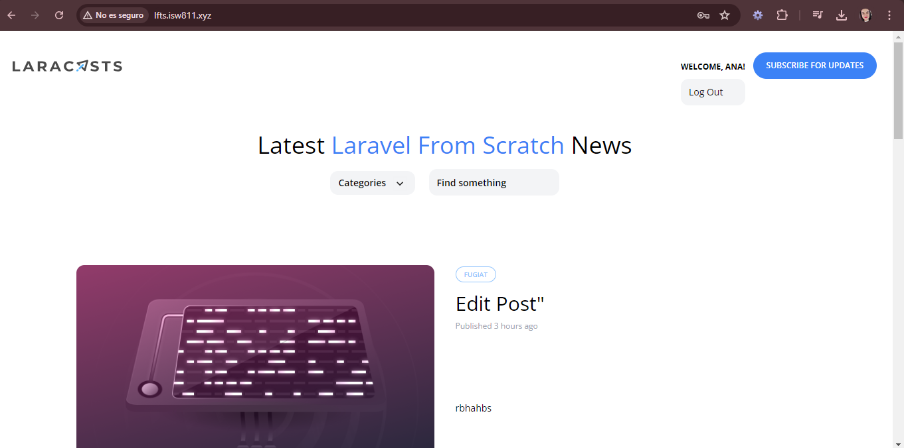

[< Volver al índice](../index.md)

# All About Authorization

En este episodio se arregla un problema que existe ya que cualquier usuario puede crear posts y no solo los administradores, lo cual no debe ser asi. Para ello se realizan las siguientes modificaciones:

- En nuestro archivo `AppServiceProvider` ubicado en la ruta *app/providers* modificamos la funcion `boot()` quedando de la siguiente manera:

```php
public function boot()
    {
        Model::unguard();
        Gate::define('admin', function (User $user) {
            return $user->username === 'Verogc9612';
        });

        Blade::if('admin', function () {
            return request()->user()?->can('admin');
        });
    }
```

- Y eliminamos el middleware creado en un episodio pasado llamado `MustBeAdministrator.php` ya que no se ocupa mas y eliminamos la linea donde se incluia este middleware en el archivo `Kernel.php` en `$routeMiddleware`.

- Posteriormente modificamos los elementos del dropdown que necesitamos que aparezcan solamente si el usuario es administrador, de lo contrario mostrar solamente logout.

```php
@admin
    <x-dropdown-item href="/admin/posts" :active="request()->is('admin/posts')">Dashboard</x-dropdown-item>
    <x-dropdown-item href="/admin/posts/create" :active="request()->is('admin/posts/create')">New Post</x-dropdown-item>
@endadmin
```

- Finalmente en nuestro archivo de rutas `web.php` vamos a eliminar todas las que se habian creado para la seccion de Admin y las vamos a reemplazar por este codigo:

```php
Route::middleware('can:admin')->group(function () {
    Route::resource('admin/posts', AdminPostController::class)->except('show');
});
```

Lo anterior debido a que gracias a la herramienta `resource` podemos resumir todas las rutas en este bloque de codigo.

### Admin User:


### Not Admin User


