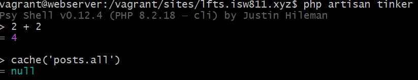
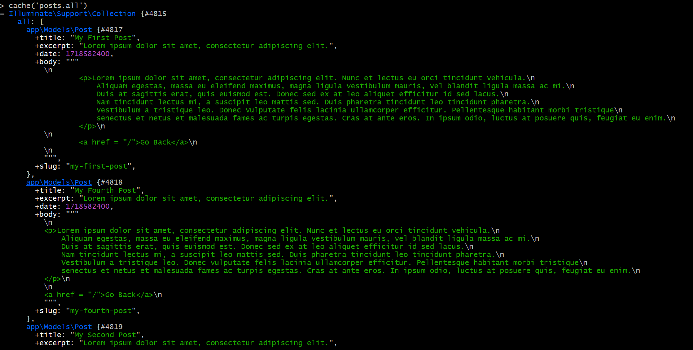

[< Volver al índice](../index.md)

# Collection Sorting and Caching Refresher

En este episodio se procede a hacer un ordenamiento de los datos utilizando la metadata configurada anteriormente, esto se realiza inicialmente en el archivo `Post.php` de la carpeta Models y modificamos la funcion `all()` quedando de la siguiente manera:

```php
public static function all()
    {
        return cache()->rememberForever('posts.all', function () {
            return collect( File::files(resource_path("posts")))
            ->map(fn($file) => YamlFrontMatter::parseFile($file))

            ->map(fn($document) => new Post(
                $document->title,
                $document->excerpt,
                $document->date,
                $document->body(),
                $document->slug,
            ))

            ->sortBy('date');
        });

    }
```

El ordenamiento por defecto es *ascendente*. Si lo quisieramos de forma descendente seria `sortByDesc('date');`.

Acá también configuramos para que los datos sean almacenados por siempre en la memoria caché para hacer más rapia nuestra aplicación.

## Tinker

En php existe una consola de comandos que nos permite interacturar con las clases y metodos que se encuentran en la aplicacion, para poder utilizarla se utiliza el comando `php artisan tinker`. Por ejemplo para ver la cache de nuestra aplicacion se le indica el comando `cache('posts.all')` y nos va a dar el siguiente resultado:



Pero si ejecutamos nuestra aplicacion al menos una vez si nos lanzará un resultado según la información almacenada en la caché:



Puedes borrar la caché desde Tinker con el comando `cache()->forget(posts.all)`;
Y si quieres agregar data a la caché sería con `cache()-.put('data','data')` y se puede agregar el tiempo que desea que se guarde esa informacion con `cache()-.put(['data'=> 'data'], now()->addSeconds(3));`.


