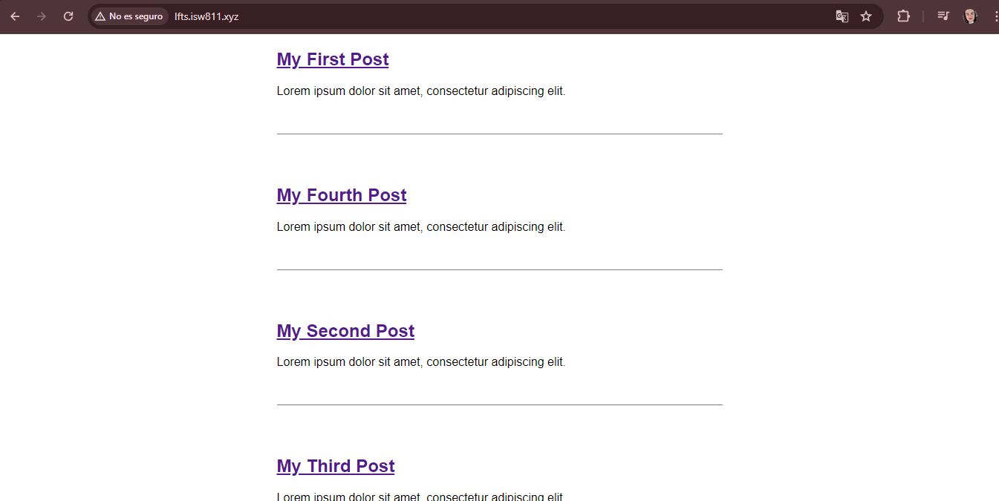
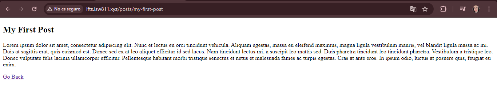

[< Volver al índice](../index.md)

# Find a Composer Package for Post Metadata

En este proyecto se utilizará metadatos para acceder a los datos contenidos en el html para colocar los posts de forma ordenada sin tener que realizarlo manualmente. Para ello nos ubicamos en nuestra máquina virtual de webserver en el directorio raiz e instalamos un paquete desde `cd /vagrant/sites/lfts.isw811.xyz` por medio de composer con el comando `composer require spatie/yaml-front-matter`.

Se modifican los siguientes archivos quedando el codigo de la siguiente manera:

## web.php:
Se modifica el codigo para que la vista retorne las funciones creadas en el Modelo `Post.php`

```php
Route::get('/', function () {
   return view ('posts', [
    'posts'=> Post::all()
   ]);
});

Route::get('/posts/{post}', function ($slug) {

    return view ('post', [
        'post'=> Post::find($slug)
    ]);
})->where ('post', '[A-z_\-]+');
```

## Post.php
Se crea el modelo para luego llamarlo cuando se llaman las vistas. Se crea el constructor y se utilizan colecciones para acceder a los archivos a los que deseamos nos aparezcan en la pagina web.

```php
<?php

namespace app\Models;

use Illuminate\Support\Facades\File;
use Spatie\YamlFrontMatter\YamlFrontMatter;

class Post
{

    public $title;
    public $excerpt;
    public $date;
    public $body;
    public $slug;


    /**
     * Post constructor
     * @param $title
     * @param $excerpt
     * @param $date
     * @param $body
     * @param $slug
     */

    public function __construct($title, $excerpt, $date, $body, $slug)
    {
        $this->title = $title;
        $this->excerpt = $excerpt;
        $this->date = $date;
        $this->body = $body;
        $this->slug = $slug;
    }

    public static function all()
    {
        return collect( File::files(resource_path("posts")))
        ->map(fn($file) => YamlFrontMatter::parseFile($file))

        ->map(fn($document) => new Post(
            $document->title,
            $document->excerpt,
            $document->date,
            $document->body(),
            $document->slug,
        ));
    }

    public static function find($slug)
    {
       return static::all() -> firstWhere('slug', $slug);
    }
}
```

## post.blade.php
Se modifica el documento para que se muestre el post en el que se le pasa el slug por parametro:

```php
<!DOCTYPE html>
    <title>LFTS</title>
    <link rel="stylesheet" href="../../public/app.css">
<body>
   <article>
        <h1><?=$post->title; ?></h1>
        <div>
            <?=$post->body; ?>
        </div>
    </article>
</body>
</html>
```

## posts.blade.php
Se modifica de forma que se realice una iteracion de los archivos ubicados en posts y se le pasa el slug por parametro.


```php
<!DOCTYPE html>
    <title>LFTS</title>
    <link rel="stylesheet" href="app.css">
</head>
<body>
    <?php foreach ($posts as $post): ?>
   <article>

    <h1>
        <a href="/posts/<?= $post->slug; ?>">
        <?= $post->title;?>
        </a>
    </h1>

    <div>
        <?= $post->excerpt;?>
    </div>

    </article>
    <?php endforeach; ?>
</body>
</html>
```

## Todos los html creados en la carpeta posts, se les agrega la metadata para manipular la informacion contenida.

La primera parte se refiere a la metadata, y o que se encuentra luego se reconoce como body.

```html
---
title: My Fourth Post
slug: my-fourth-post
excerpt: Lorem ipsum dolor sit amet, consectetur adipiscing elit.
date: 2024-06-17
---

<p>Lorem ipsum dolor sit amet, consectetur adipiscing elit. Nunc et lectus eu orci tincidunt vehicula.
    Aliquam egestas, massa eu eleifend maximus, magna ligula vestibulum mauris, vel blandit ligula massa ac mi.
    Duis at sagittis erat, quis euismod est. Donec sed ex at leo aliquet efficitur id sed lacus.
    Nam tincidunt lectus mi, a suscipit leo mattis sed. Duis pharetra tincidunt leo tincidunt pharetra.
    Vestibulum a tristique leo. Donec vulputate felis lacinia ullamcorper efficitur. Pellentesque habitant morbi tristique
    senectus et netus et malesuada fames ac turpis egestas. Cras at ante eros. In ipsum odio, luctus at posuere quis, feugiat eu enim.
</p>

<a href = "/">Go Back</a>
```

Hasta el momento se visualiza de la siguiente manera:



