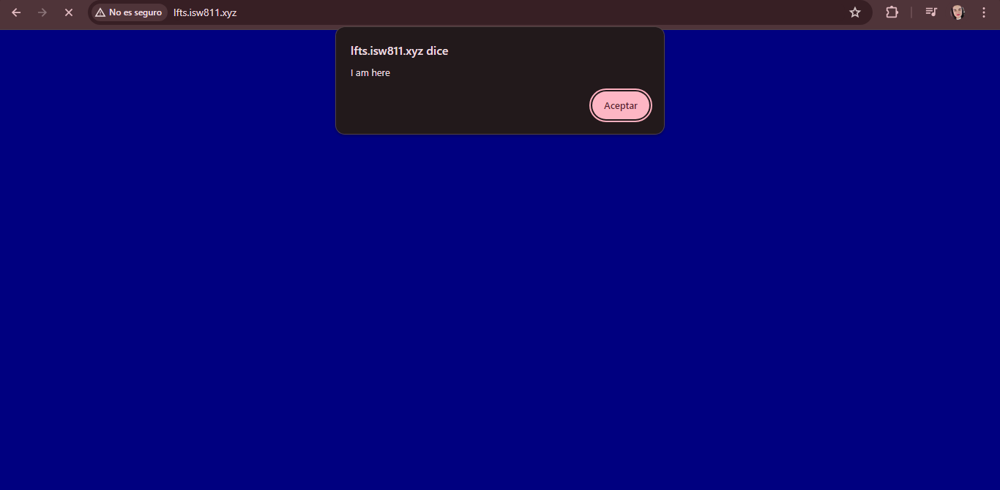
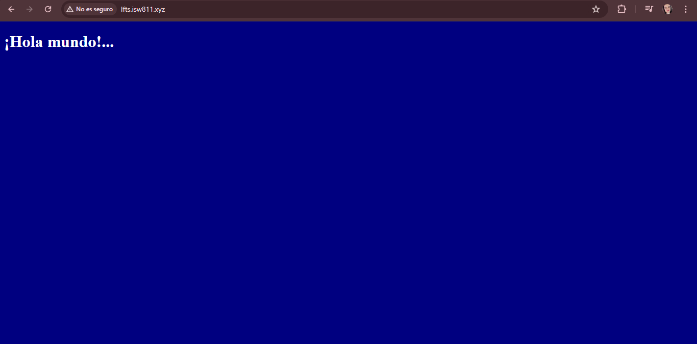

[< Volver al índice](../index.md)

# Include CSS and JavaScript

Laravel soporta múltiples mecanismos avanzados para gestionar las hojas de estilo en cascada y los archivo JS, pero en esta primera versión lo haremos de la manera clásica.

Vamos a crear un archivo `/public/app.css` con el siguiente contenido.

```bash
- cd ISW811\VMs\webserver\sites\lfts.isw811.xyz\public
- touch app.css
- code app.css
```

Y agregamos el siguiente código

```css
body {
    background: navy;
    color: white;
}
```

Y luego vamos a crear el archivo `/public/app.js` con el siguiente contenido.

```javascript
alert('I am here');
```

Ahora modificamos la vista _Welcome_ con el siguiente código.

```html
<!DOCTYPE html>
<html lang="en">
<head>
    <meta charset="UTF-8">
    <title>LFTS</title>
    <script src="app.js"></script>
    <link rel="stylesheet" href="app.css">
</head>
<body>
    <h1>¡Hola mundo!...</h1>
</body>
</html>
```

Y la vista ahora luce así.





