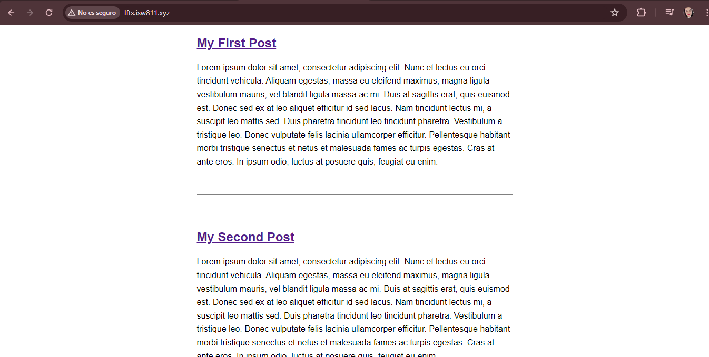
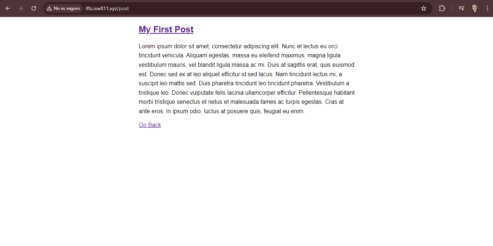

[< Volver al índice](../index.md)

## Make a Route and Link to it

Para poder lograr que una página web sea utilizable, necesitamos crear rutas para poder acceder a todos los elementos disponibles, por lo que en el documento llamado `web.php` ubicado en la carpeta `public` es donde vamos a indicar los endpoints para poder navegar, y por supuesto cada endpoint debe tener su propia vista.

Vamos a modificar la vista que anteriormente estaba como _Welcome_ y la vamos a cambiar a _Posts_ por lo que el documento será nombrado `posts.blade.php` y en el documento `web.php` se varió de la siguiente manera:

```php
Route::get('/', function () {
    return view('posts');
});
```

Se modifica el documento `app.css` de la siguiente forma:

```css
body {
    background: white;
    color: black;
    max-width: 600px;
    margin: auto;
    font-family: sans-serif;
}

p {
    line-height: 1.6;
}

article + article {
    margin-top: 3rem;
    padding-top: 3rem;
    border-top: 1px solid grey;
}
```

El documento llamado `posts.blade.php` quedaria asi:

```html
<!DOCTYPE html>
<html lang="en">
<head>
    <meta charset="UTF-8">
    <title>LFTS</title>
    <link rel="stylesheet" href="app.css">
</head>
<body>
   <article>
        <h1><a href="/post">My First Post</a></h1>
        <p>Lorem ipsum dolor sit amet, consectetur adipiscing elit. Nunc et lectus eu orci tincidunt vehicula. 
            Aliquam egestas, massa eu eleifend maximus, magna ligula vestibulum mauris, vel blandit ligula massa ac mi. 
            Duis at sagittis erat, quis euismod est. Donec sed ex at leo aliquet efficitur id sed lacus. 
            Nam tincidunt lectus mi, a suscipit leo mattis sed. Duis pharetra tincidunt leo tincidunt pharetra. 
            Vestibulum a tristique leo. Donec vulputate felis lacinia ullamcorper efficitur. Pellentesque habitant morbi tristique 
            senectus et netus et malesuada fames ac turpis egestas. Cras at ante eros. In ipsum odio, luctus at posuere quis, feugiat eu enim.</p>
    </article>
    <article>
        <h1><a href="/post">My Second Post</a></h1>
            <p>Lorem ipsum dolor sit amet, consectetur adipiscing elit. Nunc et lectus eu orci tincidunt vehicula. 
            Aliquam egestas, massa eu eleifend maximus, magna ligula vestibulum mauris, vel blandit ligula massa ac mi. 
            Duis at sagittis erat, quis euismod est. Donec sed ex at leo aliquet efficitur id sed lacus. 
            Nam tincidunt lectus mi, a suscipit leo mattis sed. Duis pharetra tincidunt leo tincidunt pharetra. 
            Vestibulum a tristique leo. Donec vulputate felis lacinia ullamcorper efficitur. Pellentesque habitant morbi tristique 
            senectus et netus et malesuada fames ac turpis egestas. Cras at ante eros. In ipsum odio, luctus at posuere quis, feugiat eu enim.</p>
   </article>
   <article>
        <h1><a href="/post">My Third Post</a></h1>
            <p>Lorem ipsum dolor sit amet, consectetur adipiscing elit. Nunc et lectus eu orci tincidunt vehicula. 
            Aliquam egestas, massa eu eleifend maximus, magna ligula vestibulum mauris, vel blandit ligula massa ac mi. 
            Duis at sagittis erat, quis euismod est. Donec sed ex at leo aliquet efficitur id sed lacus. 
            Nam tincidunt lectus mi, a suscipit leo mattis sed. Duis pharetra tincidunt leo tincidunt pharetra. 
            Vestibulum a tristique leo. Donec vulputate felis lacinia ullamcorper efficitur. Pellentesque habitant morbi tristique 
            senectus et netus et malesuada fames ac turpis egestas. Cras at ante eros. In ipsum odio, luctus at posuere quis, feugiat eu enim.</p>
   </article>
</body>
</html>
```

Posteriormente, si se desea agregar una nueva ruta es simplemente modificar el documento `web.php` de la siguiente manera, en este caso se desea que cada titulo de post rediriga al detalle del post a la ruta `/post`:

```php
Route::get('/post', function () {
    return view('post');
});

```

Y creamos una nueva vista llamada `post.blade.php` en la carpeta de `/resources/view` con el siguiente codigo `html`, donde también estamos incluyendo en redireccionamiento a la pantalla de inicio:

```html
<!DOCTYPE html>
<html lang="en">
<head>
    <meta charset="UTF-8">
    <title>LFTS</title>
    <link rel="stylesheet" href="app.css">
</head>
<body>
   <article>
        <h1><a href="/post">My First Post</a></h1>
        <p>Lorem ipsum dolor sit amet, consectetur adipiscing elit. Nunc et lectus eu orci tincidunt vehicula. 
            Aliquam egestas, massa eu eleifend maximus, magna ligula vestibulum mauris, vel blandit ligula massa ac mi. 
            Duis at sagittis erat, quis euismod est. Donec sed ex at leo aliquet efficitur id sed lacus. 
            Nam tincidunt lectus mi, a suscipit leo mattis sed. Duis pharetra tincidunt leo tincidunt pharetra. 
            Vestibulum a tristique leo. Donec vulputate felis lacinia ullamcorper efficitur. Pellentesque habitant morbi tristique 
            senectus et netus et malesuada fames ac turpis egestas. Cras at ante eros. In ipsum odio, luctus at posuere quis, feugiat eu enim.</p>
    </article>

    <a href = "/">Go Back</a>
</body>
</html>
```

Y esto se ve así:

Posts:

Post:



