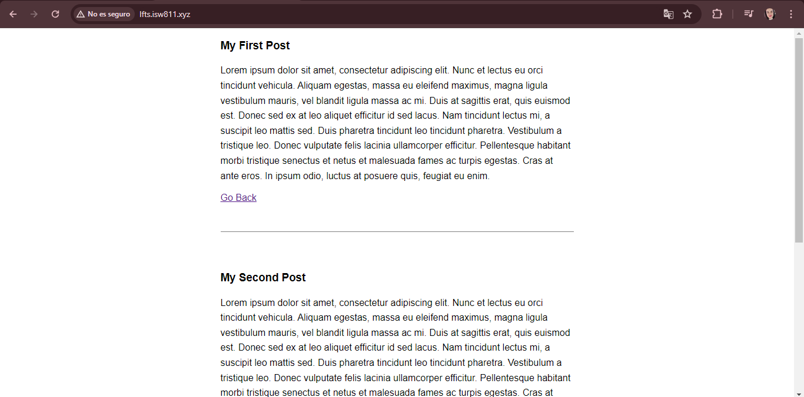

[< Volver al índice](../index.md)

# Use the Filesystem Class to Read a Directory

En Laravel se utilizan los models en la carpeta ubicada en la ruta `app/Models`. En este caso se agrega a la carpeta un archivo llamado _Post.php_ para poder importarlo en el archivo ubicado en routes, `web.php`. Ahí se agrega el siguiente codigo:

```php
<?php

namespace App\Models;

class Post 
{
    public static function find($slug)
    {

        if(! file_exists($path = resource_path("posts/{$slug}.html"))){
            throw new ModelNotFoundException();
        }

        return cache()->remember("posts.{$slug}", 1200, fn()=>file_get_contents($path));        
    }
}
```

Existen los helpers, los cuales nos facilitan realizar ciertas funciones, por ejemplo las rutas para llegar a un archivo, por ejemplo *_base_path()_* que nos brinda la ruta de la base del proyecto, *_resource_path_* que nos brinda la ruta de la carpeta resources , *_app_path()_* que nos brinda la ruta del directorio de app.

En nuestro archivo llamado `web.php` ubicado en la carpeta routes. Se actualiza el código quedando de la siguiente manera, esto para que sea más limpio:

```php
Route::get('/posts/{post}', function ($slug) {

    //Find a post by its slug and pass it to a view called "post"
    $post = Post::find($slug);

    return view ('post', [
        'post'=>$post
    ]);
})->where ('post', '[A-z_\-]+');
```

## Iteraciones en php

En nuestra app se desea que el contenido que se muestra sea dinámico, y no solamente un html que debe ser modificado cada vez que se quiera realizar algo. En nuestra vista principal de posts se realiza una modificación en el código para que el itere en el directorio donde están, y lea los html ubicados en la carpeta posts para que los muestre en nuestra vista posts. Los archivos a modificar serán `posts.blade.php`, `web.php` y `Post.php`. El código queda de la siguiente manera:

### posts.blade.php
```php
<!DOCTYPE html>
<html lang="en">
<head>
    <meta charset="UTF-8">
    <title>LFTS</title>
    <link rel="stylesheet" href="app.css">
</head>
<body>
    <?php foreach ($posts as $post): ?>
   <article>
    <?= $post; ?>
    </article>
    <?php endforeach; ?> 
</body>
</html>
```

### web.php
```php
use Illuminate\Support\Facades\Route;
use App\Models\Post;

Route::get('/', function () {
    return view('posts', [
        'posts'=>Post::all()
    ]);
});
```

### Post.php
```php
<?php

namespace app\Models;

use Illuminate\Support\Facades\File;
use Illuminate\Support\Facades\Cache;
use Illuminate\Database\Eloquent\ModelNotFoundException;

class Post 
{
    public static function all()
    {
        $files = File::files(resource_path("posts/"));
        return array_map(fn($file)=> $file->getContents(), $files);
    
    }

    public static function find($slug)
    {

        if(! file_exists($path = resource_path("posts/{$slug}.html"))){
            throw new ModelNotFoundException();
        }

        return cache()->remember("posts.{$slug}", 1200, fn()=>file_get_contents($path));        
    }
}
```

Y así luce en este momento:

