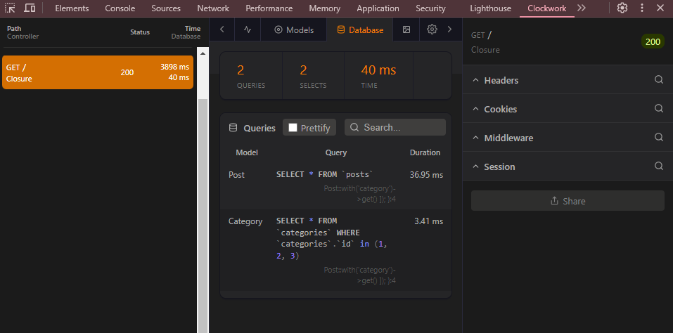

[< Volver al índice](../index.md)

# Clockwork, and the N+1 Problem

## Instalando Clockwork

Este es una herramienta de php que contiene dev tools. Se ejecutan los siguientes comandos para su instalacion:

```bash
cd /vagrant/sites/lfts.isw811.xyz
composer require itsgoingd/clockwork
php artisan vendor:publish --provider="Clockwork\Support\Laravel\ClockworkServiceProvider"
```
Se debe de modificar el archivo en la ruta `config/clockwork` y cambiar esta linea: `'enable' => env('CLOCKWORK_ENABLE', true),` cambiandolo a true.

Ademas se debe de agregar en nuestro archivo .env `CLOCKWORK_ENABLE=true`.

Luego en la documentacion sobre Clockwork en github en el link [Github-Clockwork](https://github.com/itsgoingd/clockwork?tab=readme-ov-file) descargan la extension para el browser que se este utilizando. Debe lucir como algo asi:



Se deben de modificar el siguiente codigo para evitar que se realicen mas queries de la cuenta en nuestra base de datos:

### web.php

```php
Route::get('/', function () {
   return view ('posts', [
    'posts'=> Post::with('category')->get()
   ]);
});
```


