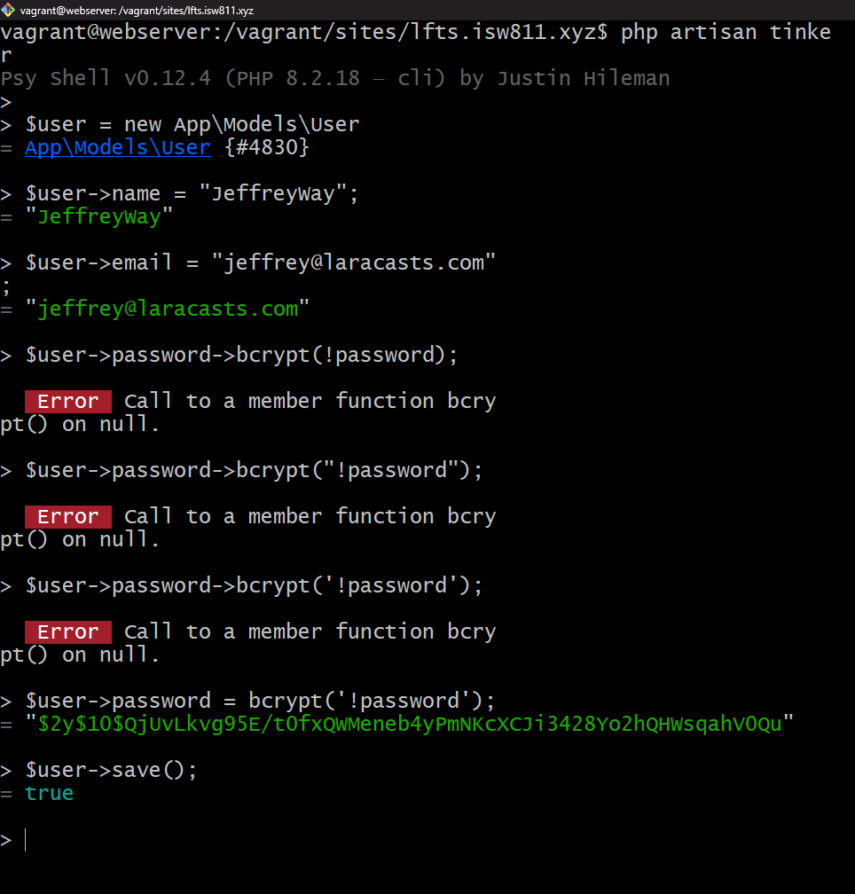
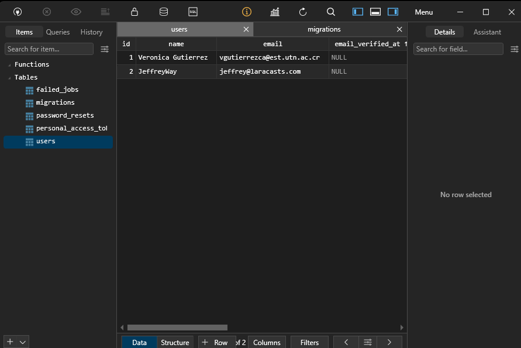

[< Volver al índice](../index.md)

# Eloquent and the Active Record Pattern

Se utiliza Eloquent parael manejo sencillo los procesos correspondiente a la administracion de las Bases de Datos en nuestro proyecto.
Y el Active Record Pattern es una forma de acceder a la data en las bases de datos.

## Creando un usuario con Tinker

```bash
- php artisan tinker
- $user = new App\Models\User; p $user = new User;
- $user->name = "JeffreyWay";
- $user->email = "jeffrey@laracasts.com";
- $user->password = bcrypt('!password');
- $user->save();
```

Se observa de la siguiente manera:





### Comandos en Tinker para BD

- `$user::find(1);`: Buscar el usuario con id = 1.
- `$user->name;`: retorna el nombre del usuario.
- `$user::all();`: retorna la coleccion de todos los usuarios.
- `$users->pluck('name');`: retorna los nombres de los usuarios.
