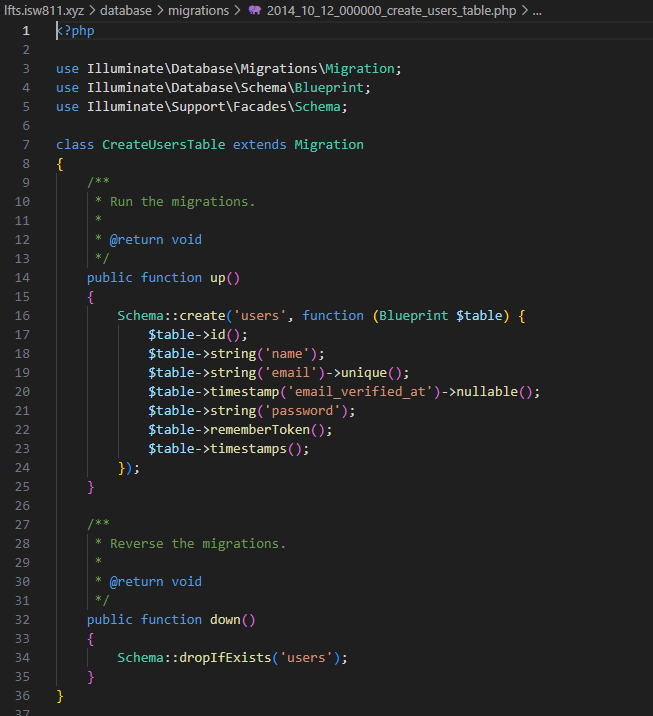

[< Volver al índice](../index.md)

# Migrations:  The Absolute Basics

Para observar el detalle de las migraciones de la base de datos debemos de ubicarnos en la carpeta _database_ y luego en _migrations_. En cada uno de los archivos se pueden observar las migraciones realizadas.

Como por ejemplo en la migración de la tabla **_users_** en la parte posterior se encuentra la función para crear, y en la parte inferior es para revertir la migración como se observa a continuación:

En la consola podemos acceder a la ayuda de artisan con el comando `php artisan` y se nos despliega la lista de comandos disponibles. Algunos de ellos puedens ser:

- `php artisan migrate:rollback`: para revertir la  migracion
- `php artisan migrate:fresh`: para actualizar la migracion, elimina todas las tablas y las actualiza con las nuevas. Nunca se utiliza en produccion
