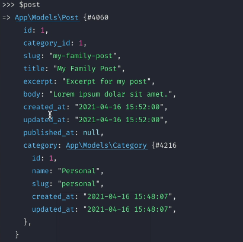

[< Volver al índice](../index.md)

# Your First Eloquent Relationship

En este video se vana a categorizar los posts y poder acceder a ellos por medio de las categorias a las que pertenecen.

- Primero se creará la tabla para las categorías con el comando `php artisan make:model Category -m` y esto nos creará el model _Category.php_ y su respectivo archivo de migración.Nos vamos a localizar en este y se modificará según las entidades que queremos que tenga nuestra tabla según se muestra a continuación:

```php
 public function up()
    {
        Schema::create('categories', function (Blueprint $table) {
            $table->id();
            $table->string('name');
            $table->string('slug');
            $table->timestamps();
        });
    }

```

Y modificaremos tambien el archivo de migracion de _create_posts_ para agregar una _Foreign Key_ para que este estrictamente relacionado a una categoria.

```php
 public function up()
    {
        Schema::create('posts', function (Blueprint $table) {
            $table->id();
            $table->foreignId('category_id');
            $table->string('title');
            $table->string('slug')-> unique();
            $table->text('excerpt');
            $table->text('body');
            $table->timestamps();
            $table->timestamp('published_at')->nullable();
        });
    }
```

Y luego ejecutamos el comando `php artisan migrate:fresh`.
Posteriormente con `php artisan tinker` ejecutamos los siguientes comandos:

```php
use App\Models\Category;
$c = new Category;
$c ->name = 'Personal';
$c ->slug = 'personal';
$c->save();
```
Y repetimos con otros datos para crear otra categoria.
Luego nos salimos y volvemos a entrar a tinker y ejeutamos los siguientes comandos para crear los posts ya con el _category_id_ agregado::

```php
- use App\Models\Post;
- Post::create(['title'=> 'My Family Post', 'excerpt'=> 'Excerpt for my post', 'body'=>'Lorem Ipsum dolar sit amet.', 'slug'=> 'my-family-post', 'category_id' => 1]);
- Post::create(['title'=> 'My Work Post', 'excerpt'=> 'Excerpt for my post', 'body'=>'Lorem Ipsum dolar sit amet.', 'slug'=> 'my-work-post', 'category_id' => 2]);
- Post::create(['title'=> 'My Hobby Post', 'excerpt'=> 'Excerpt for my post', 'body'=>'Lorem Ipsum dolar sit amet.', 'slug'=> 'my-hobby-post', 'category_id' => 3]);
```

## Creando una Eloquent Relationship

Estaq relacion se realizará entre el id de _category_ y el dato indicado en _category_id_. Existen diferentes tipos de relaciones como: _hasOne_, _hasMany_, _belongsTo_, _belongsTo Many_.

En este caso se utiliza _belongsTo_ porque pertenece a una categoria, para aplicar esta relacion se debe de agregar la siguiente funcion en el archivo Post.php de la carpeta models:

```php
  public function category()
    {
        return $this->belongsTo(Category::class);
    }
```

Esto lo podemos confirmar ingresando nuevamente a `php artisan tinker` y lanzar los comandos:
- `$post = App\Models\Post::first();`
- `$post` para ver todos los detalles del post incluyendo la data de la categoria, se debe ver algo asi:



Luego para agregar el nombre de la categoria en en el post agregamos las siguientes lineas de codigo despues del titulo en los archivos `posts.blade.php` y `post.blade.php`

```html
<p>
    <a href="#">{{ $post->category->name }}</a>
</p>
```
