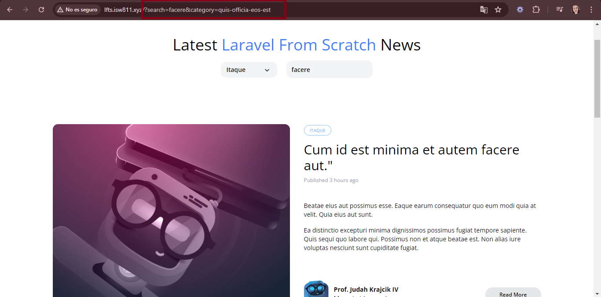
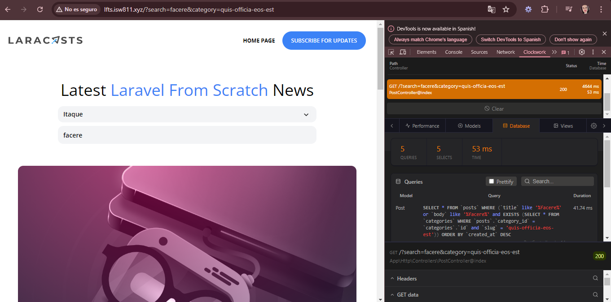

[< Volver al índice](../index.md)

# Advanced Eloquent Query Constraints

Existen mejores maneras de realizar un filtrado de datos en una pagina web y es utilizando Eloquent Queries mas avanzados que nos permiten acceder a los datos de una manera mas eficiente, en este proyecto se van a modificar los siguientes archivos para hacer esto posible:

### PostController.php
- Agregamos el "currentCategory" para que se reconoza la categoria que se encuentra seleccionada.

```php
public function index()
    {
        return view('posts', [
            'posts' => Post::latest()->filter(request(['search', 'category']))->get(),
            'categories' => Category::all(),
            'currentCategory' => Category::firstWhere('slug', request('category'))
        ]);
    }
```

### Post.php
- Se modifica la funcion de scopeFilter agregando el filtrado de las categorias junto con el query de la barra de busqueda:

```php
    public function scopeFilter($query, array $filters)
    {
        $query->when($filters['search'] ?? false, fn($query, $search) =>
            $query
                ->where('title', 'like', '%' . $search . '%')
                ->orWhere('body', 'like', '%' . $search . '%'));

        $query->when($filters['category'] ?? false, fn($query, $category) =>
            $query->whereHas('category', fn ($query) =>
                $query->where('slug', $category)
            ));
    }
```

### _post-header.blade.php
- En donde se encuentra la ruta de categories que estaba anteriormente, se cambia por `/?category={{ $category->slug }}`:

```php
<!--  Category -->
        <div class="relative lg:inline-flex bg-gray-100 rounded-xl">
        <x-dropdown>
            <x-slot name="trigger">
                <button class="py-2 pl-3 pr-9 text-sm font-semibold w-full lg:w-32 text-left flex lg:inline-flex">
                    {{ isset($currentCategory) ? ucwords($currentCategory->name) : 'Categories' }}

                    <x-icon name="down-arrow" class="absolute pointer-events-none" style="right: 12px;"/>
                </button>
            </x-slot>

            <x-dropdown-item href="/" :active="request()->routeIs('home')">All</x-dropdown-item>

            @foreach ($categories as $category)
                <x-dropdown-item
                    href="/?category={{ $category->slug }}"
                    :active='request()->is("categories/{$category->slug}")'
                >{{ ucwords($category->name) }}</x-dropdown-item>
            @endforeach
        </x-dropdown>
        </div>
```

### web.php

- Eliminamos la ruta de categories ya que no es necesaria.

Nuestra pagina web deberia de filtrarnos por medio de la url por categoria y busqueda:




