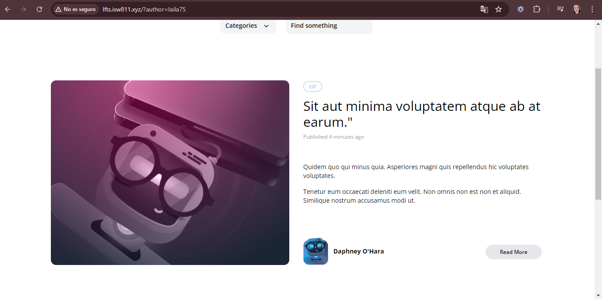

[< Volver al índice](../index.md)

# Author Filtering

Para realizar el filtrado por autor cuando se selecciona el nombre se van a seguir los siguientes pasos:

- Agregar un nuevo query e, **Post.php** para los autores

```php
$query->when($filters['author'] ?? false, fn($query, $author) =>
    $query->whereHas('author', fn ($query) =>
        $query->where('username', $author)
    )
);
```
- En **PostController.php** agregaremos el author a los requests.

```php
 public function index()
    {
        return view('posts.index', [
            'posts' => Post::latest()->filter(request(['search', 'category', 'author']))->get()

        ]);
    }
```

- Se agrega el siguiente codigo en donde aparece el nombre del autor en los archivos **show.blade.php**, **post-car.blade.php** y **post-featured-card.blade.php**

```php
 <h5 class="font-bold">
    <a href="/?author={{ $post->author->username }}">{{ $post->author->name }}</a>
</h5>
```

Y ya con eso el filtrado por autor funciona, por lo que se puede eliminar la ruta de authors del archivo **web.php**.

La pagina va luciendo asi:


