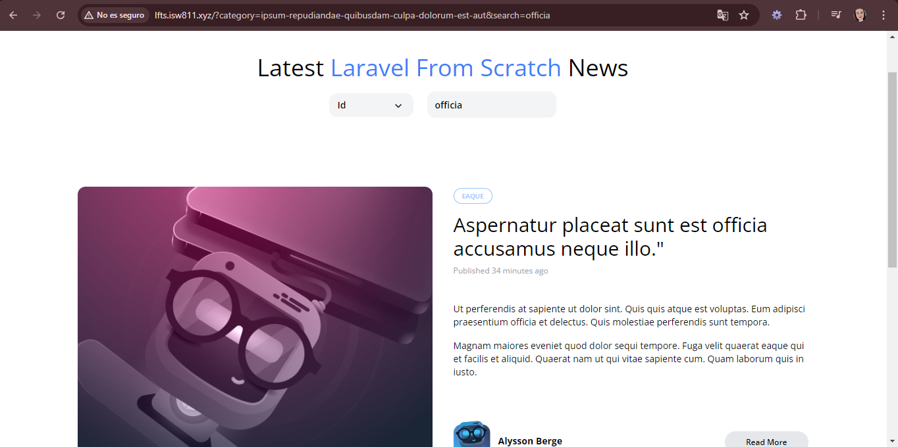
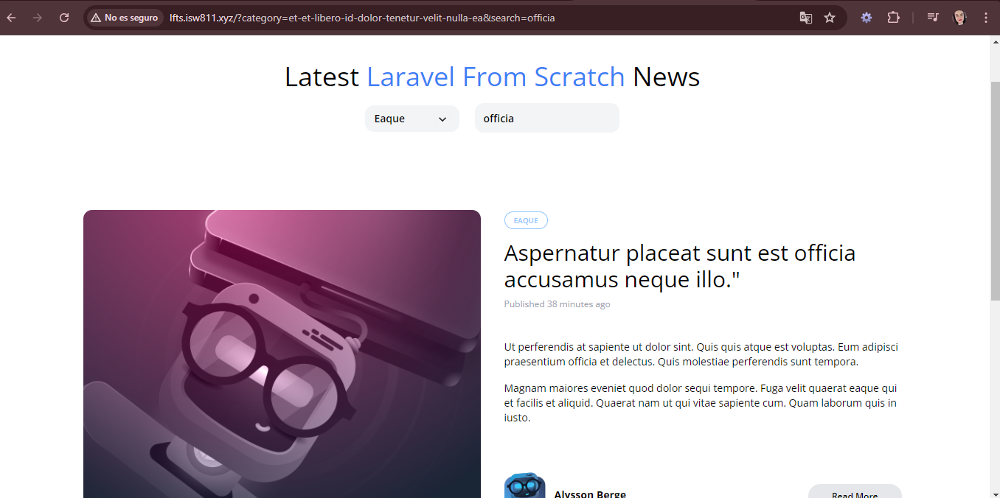

[< Volver al índice](../index.md)

# Merge Category and Search Queries

Para poder lograr que se puedan filtrar los resultados por categoria y busqueda solamente se debe modificar la forma en la que se construye el query string de nuestra url por medio del **href**. Los archivos a modificar son los siguientes:

### category-dropdown.blade.php

```php
@foreach ($categories as $category)
        <x-dropdown-item
            href="/?category={{ $category->slug }}&{{ http_build_query(request()->except('category')) }}"
            :active='request()->is("categories/{$category->slug}")'
        >{{ ucwords($category->name) }}</x-dropdown-item>
    @endforeach
```

### _header.blade.php

```php
<form method="GET" action="/">
    @if (request('category'))
        <input type="hidden" name="category" value="{{ request('category') }}">
    @endif
    <input type="text"
            name="search"
            placeholder="Find something"
            class="bg-transparent placeholder-black font-semibold text-sm"
            value="{{ request('search') }}"
    >
</form>
```

Asi se ve la pagina:




