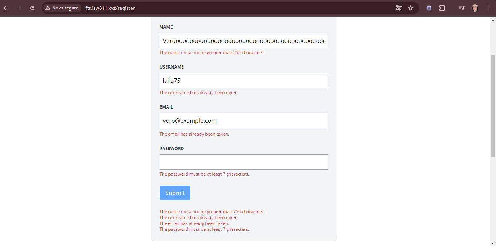

[< Volver al índice](../index.md)

# Failed Validation and Old Input Data

- En este episodio se renderiza en el archivo _create.blade.php_ los mensajes de error en caso de que no se cumpla con alguna de las condiciones para enviar a la base de datos, para ellos se envia una mensaje en formato de texto dentro del html indicando el mensaje del error asi:

```php
@error('name')
    <p class="text-red-500 text-xs mt-1">{{ $message }}</p>
@enderror
```

Esto con cada uno de los atributos "name", "username", "email" y "password", esto antes de cerrar el div de cada input.

- Ademas en el mismo archivo se agrega un old value a "name", "username", "email" para que en caso de error al refrescar la pagina no borre todos los datos, quedando de la siguiente manera:

```php
 <input class="border border-gray-400 p-2 w-full"
    type="text"
    name="name"
    id="name"
    value="{{ old('name') }}"
    required
>
```

Asi con todos y se les cambia el nombre del atributo.

- Adicional se realiza en el mismo archivo la inclusion de un bloque de codigo que nos indica al final del form, la lista de todos los errores.

```php
@if ($errors->any())
    <ul>
        @foreach ($errors->all() as $error)
                <li class="text-red-500 text-xs">{{ $error }}</li>
        @endforeach
    </ul>
@endif
```

- Y en el archivo _RegisterController.php_ cambiamos el codigo de los atributos "username", "email" para que sean unicos en la tabla.

```php
'username' => 'required|min:3|max:255|unique:users,username',
'email' => 'required|email|max:255|unique:users,email',
```

Nuestra pantalla con errores se ve de la siguiente manera:



