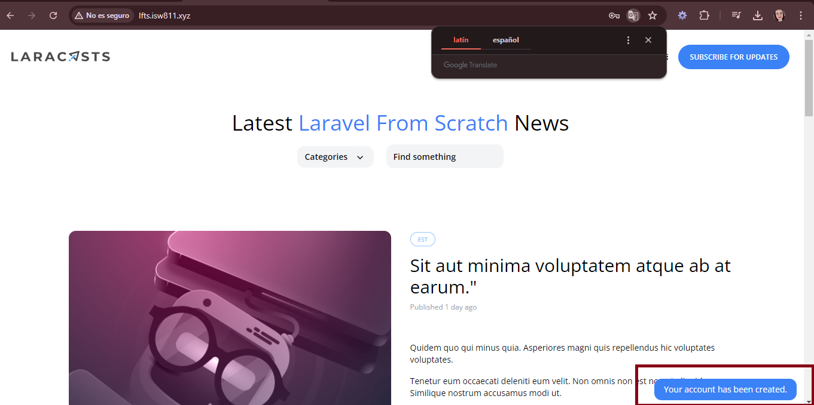

[< Volver al índice](../index.md)

# Show a Success Flash Message

Aca se crea un mensaje flash de que el usuario ha sido creado, por lo que se realizan los siguientes movimiento en el codigo:

- En el archivo _RegisterController.php_ cambiamos el codigo que nos redirige a la pagina home por el siguiente:

```php
return redirect('/')->with('success', 'Your account has been created.');
```

- En el archivo _layout.blade.php_ antes de la etiqueta del cierre del body agregamos el componente blade flash.

```php
 <x-flash />
```

 - Creamos un archivo dentro de **components** llamado _flash.blade.php_ para configurar el mensaje flash utilizando JavaScript con el siguiente codigo:

 ```php
@if (session()->has('success'))
    <div x-data="{ show: true }"
         x-init="setTimeout(() => show = false, 4000)"
         x-show="show"
         class="fixed bg-blue-500 text-white py-2 px-4 rounded-xl bottom-3 right-3 text-sm"
    >
        <p>{{ session('success') }}</p>
    </div>
@endif
 ```


Se muestra por unos segundos en la pantalla home de la siguiente forma:


