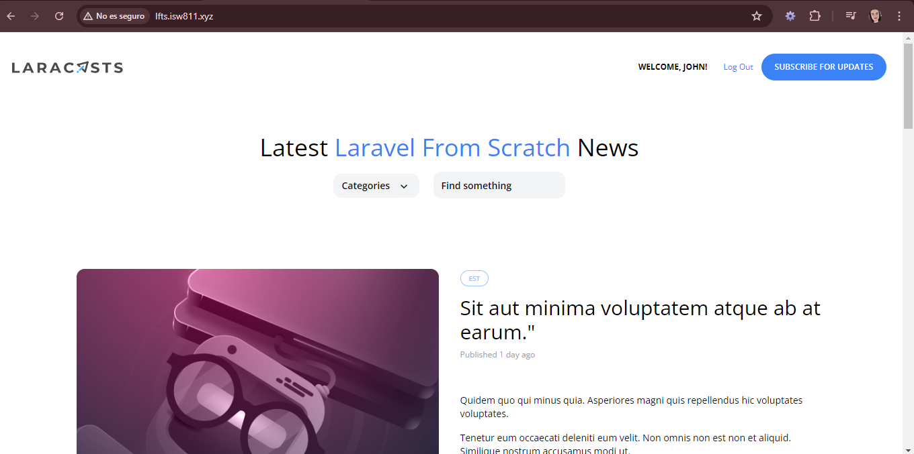

[< Volver al índice](../index.md)

# Login and Logout

En este episodio se empiezan a crear las configuraciones basicas para un log in y log out, para ello se realiza lo siguiente:

- Se crea un **SessionsController.php** con el comando `php artisan make:controller SessionsController` y en el archivo se agrega la siguiente funcion:

```php
 public function destroy()
    {
        auth()->logout();

        return redirect('/')->with('success', 'Goodbye!');
    }
```

- Luego se modifica la redireccion de la ruta de home en el archivo **RouteServiceProvider.php** ubicado en la ruta _app/Http/Providers_ para que en vez de `/home` sea `/`.

```php
public const HOME = '/';
```

- Posteriormente en el archivo **RegisterController.php** agregamos la autenticacion del usuario luego de que es registrado, por lo que primero se valida y luego cuando es exitoso hace un log in, para finalmente agregar un flash de exito.

```php
 public function store()
{
    $attributes = request()->validate([
        'name' => 'required|max:255',
        'username' => 'required|min:3|max:255|unique:users,username',
        'email' => 'required|email|max:255|unique:users,email',
        'password' => 'required|min:7|max:255',
    ]);

    $user = User::create($attributes);

    auth()->login($user);

    return redirect('/')->with('success', 'Your account has been created.');
}
```

- Seguidamente se agrega una nueva ruta para el logout en el archivo **web.php**:

```php
Route::post('logout', [SessionsController::class, 'destroy'])->middleware('auth');
```

- Finalmente modificamos nuestro archivo **layout.blade.php** en la parte del navbar con el siguiente codigo:

```php
<nav class="md:flex md:justify-between md:items-center">
    <div>
        <a href="/">
            
        </a>
    </div>

    <div class="mt-8 md:mt-0">

        <div class="mt-8 md:mt-0 flex items-center">
            @auth
                <span class="text-xs font-bold uppercase">Welcome, {{ auth()->user()->name }}!</span>

                <form method="POST" action="/logout" class="text-xs font-semibold text-blue-500 ml-6">
                    @csrf

                    <button type="submit">Log Out</button>
                </form>
            @else
                <a href="/register" class="text-xs font-bold uppercase">Register</a>
                <a href="/login" class="ml-6 text-xs font-bold uppercase">Log In</a>
            @endauth

        <a href="#" class="bg-blue-500 ml-3 rounded-full text-xs font-semibold text-white uppercase py-3 px-5">
            Subscribe for Updates
        </a>
    </div>
</nav>
```

#### Asi se debe ver el home del usuario autenticado:


