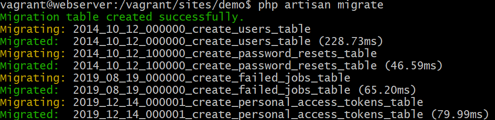
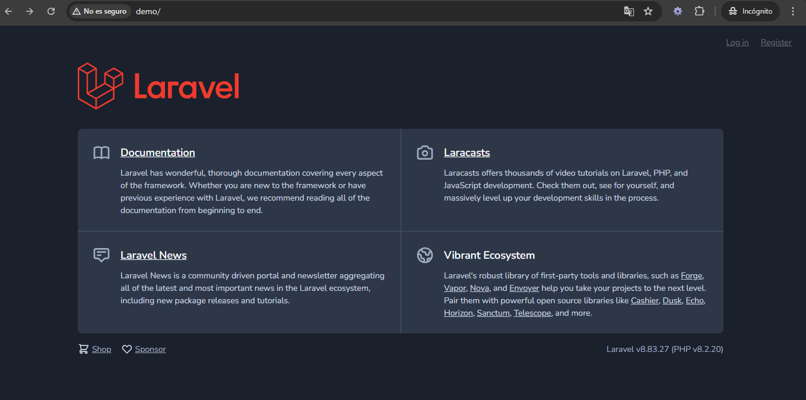

[< Volver al índice](../index.md)

# Laravel Breeze Quick Peek

- Primeramente se realiza un refactor del codigo de _SessionsController.php_ en la funcion store() quedando de la siguiente manera:

```php
public function store()
    {
        $attributes = request()->validate([
            'email' => 'required|email',
            'password' => 'required'
        ]);

        if (! auth()->attempt($attributes)) {
            throw ValidationException::withMessages([
                'email' => 'Your provided credentials could not be verified.'
            ]);
        }

        session()->regenerate();

        return redirect('/')->with('success', 'Welcome Back!');
    }
```

Luego procedemos a crear un nuevo proyecto llamado **demo** para instalar Breeze, esto es con los siguientes comandos ubicados en nuestra maquina virtual de webserver

- `cd /vagrant/sites`
- `sudo composer self-update`: verificar si tenemos la última versión de composer o instalarla.
- `composer --global config process-timeout 2000`
- `composer create-project laravel/laravel:8.6.12 demo`: para crear el proyecto laravel
- `php artisan breeze:install`
- `npm install && npm run dev`
- `php artisan serve`

#### En mi máquina anfitriona:
- Abrimos el cmd como administrador.
- `cd \drivers\etc`
- `notepad hosts` y agregamos la entrada demo en la ultima línea.

Creamos el archivo conf de nuestra pagina:
- `cd ISW811/VMs/webserver/confs`
- `touch demo.conf` para crear un archivo tipo conf para el VirtualHost de la pagina
- Se codifica el archivo .conf asi, IMPORTANTE AGREGAR EN EL DIRECTORIO LA CARPETA PUBLIC POR SER PROYECTO LARAVEL:

```conf
<VirtualHost *:80>
ServerAdmin webmaster@demo
ServerName demo

# Indexes + Directory Root.
DirectoryIndex index.php index.html
DocumentRoot /home/vagrant/sites/demo/public  

<Directory /home/vagrant/sites/demo/public>
    DirectoryIndex index.php index.html
    AllowOverride All
    Require all granted
</Directory>

ErrorLog ${APACHE_LOG_DIR}/demo.error.log
LogLevel warn
CustomLog ${APACHE_LOG_DIR}/demo.access.log combined
</VirtualHost>
```

#### Desde mi máquina virtual webserver:

```bash
- cd /vagrant/confs
- sudo cp demo.conf /etc/apache2/sites-available/
- sudo apachectl -t
- sudo a2ensite demo.conf
- sudo apachectl -t
- sudo systemctl reload apache2
```
- - Luego creamos un archivo en la carpeta en database del proyecto llamada _database.sqlite_

- Desde la máquina anfitriona nos ubicamos en `cd ISW811/VMs/webserver/sites/demo`

- `code .env` para agregar las credenciales según se muestra a continuación:

```
DB_CONNECTION=sqlite
DB_HOST=127.0.0.1
DB_PORT=3306
DB_DATABASE=/vagrant/sites/demo/database/database.sqlite
DB_USERNAME=root
DB_PASSWORD=
```

- Desde la máquina webserver nos ubicamos en `cd /vagrant/sites/demo`.
- Ejecutamos el comando `sudo apt-get install php-sqlite3` para instalar sqlite.
- `php artisan migrate`






